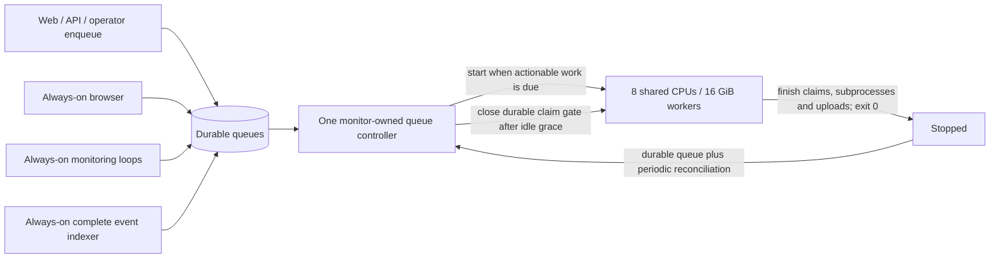

# Queue-aware worker lifecycle

This change is shipped **off**. It does not enable production stopping or resize
monitoring merely by merging. Activate through the staged rollout below after
healthy-load and cost validation. No RPC-provider settings or retry policies
are changed.

## Layout and ownership



The monitor group hosts the existing monitoring supervisor, the complete event
indexer, and one lifecycle controller. These are isolated processes: a failed
controller/indexer restarts with backoff without interrupting healthy monitoring
loops. Heavy protocol governance enrollment remains on workers. Only its cheap
daily-repair scheduler moves to monitoring. The daily minimum age remains
`PSAT_RECONCILE_SWEEP_MIN_AGE_S=86400`; scheduling retains the existing 600-second
cadence and bounded sweep width.

Workers retain their configured static/resolution/policy counts and policy
concurrency, plus discovery, effects, coverage, verification, selection,
DefiLlama, audit text, audit scope and heavy enrollment. Browser/web placement is
unchanged. The indexer's analysis enrollment, backfill, reconciliation and reorg
handling remain continuously available; moving it is not a monitoring-only move.

`ProcessSingleton` holds a non-expiring PostgreSQL **session advisory lock** for
each managed group and for the indexer across both placements. A replacement
waits until its predecessor has exited. This requires an explicit direct
PostgreSQL connection (`PSAT_LIFECYCLE_DATABASE_URL`), never a transaction-pooling
endpoint. Business sessions keep their existing pooling. Ownership checks run
every five seconds, use bounded connection/query timeouts, and never reconnect
silently. Ownership loss terminates descendants and leaves claims for ordinary
recovery. Like the existing pipeline, forced failure recovery is at least once;
there is no promise of exactly-once external provider side effects.

## Wake and drain protocol

The controller polls every 15 seconds by default. `services/worker_workload.py`
checks actual eligibility using bounded `EXISTS` probes:

| Source | Readiness / owner |
|---|---|
| User/API submissions, monitor reanalysis, direct database job inserts | Normal queued stage, due retry, no pending dependencies |
| Dependency completion | Existing satisfied/degraded dependency state unblocks the queued job |
| Coverage / selection | Shared predicates preserve ready-first claims and the existing stuck fallback |
| Audit text / scope | Existing column-state eligibility; scope waits for successful text |
| Coverage verification | Pending row attached to a non-proxy contract; orphan proxy rows do not wake workers |
| Crashed analysis / audit / verification | Wake when existing expiry/staleness predicates permit recovery |
| Dirty protocol enrollment / retries | Due dirty timestamp and absent/expired lease |
| Daily enrollment repair | Always-on scheduler inserts durable due work; it does no governance build |
| Indexer dirty queues, scan/backfill, score queue and monitoring schedules | Remain on the monitor; do not wake analysis merely because RPC is unavailable |

The existing synchronous administrative re-enrollment API remains compatible:
it records its durable dirty request and retains its current immediate result
contract. Its explicitly requested inline web work is not an idle worker wake
source beyond that durable request. Operator scripts that execute computation
directly must use the managed worker environment or enqueue work; no controller
can discover work that exists only in an unrecorded command.

Each managed worker boot has a durable UUID. Every claim transaction takes the
same short row lock on `worker_lifecycle`, checks its boot and `running` phase,
and records successful activity in the claim transaction. Thus short jobs
between polls still reset the idle timer. Browser consumers have no worker boot
ID and retain their existing behavior.

After five idle minutes, the controller atomically changes the current boot to
`draining`. Claimers stop acquiring work. The launcher signals consumers, which
finish their active jobs, futures, children, database commits and artifact
uploads. Lease renewal continues; SIGTERM no longer releases live job leases.
The launcher exits zero only after children finish. `on-failure` restarts crashes
but leaves a deliberate clean exit stopped. Ordinary job finalizers check the
current database lease under a row lock, including a NULL/released lease.
Coverage claims now mint leases like other job consumers.

A job arriving after the gate closes remains queued. The controller never tries
to cancel an irreversible drain; it waits for Fly to report `stopped`, then
starts the machine. Start intent/cooldown is committed before the API call. A
lost response, rejected request or controller restart is repaired from the queue
and actual Machine state on subsequent passes, with a 60-second start cooldown.
Future retries and unexpired orphan leases can mature while stopped.

Any uncertain DB/API read inhibits shutdown. Unexpected topology, a live standby,
an HTTP service on workers, the wrong restart policy or workers still owning the
indexer inhibits lifecycle actions and produces an error heartbeat. Active
standby failover requires operator reconciliation before automated lifecycle or
deployment resumes; the controller does not wake a second large VM.

Ordinary indexer reconciliation and heavy enrollment now fence and renew their
queue lease **inside every business commit**, including internal commits, and
guard final acknowledgement. A replaced lease cannot publish a late transaction
after takeover. Heavy enrollment claims each protocol immediately before its
build and keeps the lease alive with an independent session. Expiry makes a row
eligible for takeover; an unchanged enrollment UUID can atomically renew, while
a replaced UUID rejects the old owner's commit. This also handles a long
transaction holding its own queue row past the TTL. Shutdown finishes the active
build and joins its keepalive before exiting. Indexer shutdown joins the backfill
thread before releasing singleton ownership.

## Configuration and staged rollout

The canonical `fly.toml` stays `off`, indexer on `workers`, monitoring 512 MiB.
The production workflow renders a temporary configuration from repository
variables, preserving worker size/concurrency and the existing health secret:

| Repository variable | Initial bridge | Split observation | Enabled |
|---|---|---|---|
| `PSAT_LIFECYCLE_MODE` | `observe` | `observe` | `enforce` |
| `PSAT_INDEXER_GROUP` | `workers` | `monitor` | `monitor` |
| `PSAT_MONITOR_MEMORY_MB` | `2048` or `4096` | validated choice | validated choice |

These map to runtime `PSAT_WORKER_LIFECYCLE_MODE` and `PSAT_INDEXER_GROUP`.
`PSAT_LIFECYCLE_POLL_S` defaults to 15; `PSAT_LIFECYCLE_IDLE_S` to 300 (minimum 30).
Changing concurrency, retry policy or RPC configuration is unnecessary.

Required secrets are the direct `PSAT_LIFECYCLE_DATABASE_URL` and
`PSAT_WORKER_LIFECYCLE_TOKEN`. The latter may be absent during observation, in
which case actual VM state is explicitly recorded as unobserved. Enforce needs
it. Use an expiring app-scoped credential attenuated to machine read/control,
the intended worker Machine and the monitor source Machine where supported.
Do not install an organization/personal credential. Fly's control capability may
cover more than start: the application only implements list/read and start;
validate the actual token caveats in a separate test app before enabling. Fly
app secrets are shared across groups, so source restrictions matter; the managed
launcher removes this credential from analysis/indexer child environments.
Rotate caveats when a Machine identity changes. See [Fly token caveats](https://github.com/superfly/macaroon/blob/main/flyio/caveats.md).

1. Apply the additive migration and ship the bridge release with indexer still
   on workers. Provision monitoring headroom with the rendered configuration;
   keep this temporary extra-spend phase bounded. Verify direct-DB ownership,
   worker boot identity, controller observations and unchanged pipeline results.
   Do not jump directly from a legacy image to moved indexing: the deployment
   guard requires the bridge so both sides honor indexer ownership.
2. Move the full indexer in **observe** mode. The deploy helper pauses lifecycle,
   closes the claim gate and waits up to 20 minutes for actual worker stopping;
   it does not kill/stop the VM. The old indexer exits and releases its own lock
   before the monitor's indexer can run. Monitoring loops stay on monitoring.
   Fly preserves an updated machine's stopped state. The deployment helper
   explicitly starts workers, including in observe mode, and verifies a fresh
   running boot before health/smoke checks. The controller stays paused through
   this handover; CI is a one-shot deployment owner, not another supervisor.
3. Collect a representative healthy workload cycle (preferably 7–14 days),
   including analysis-dependent indexing, catch-up, daily repair and audits.
   Validate monitoring headroom/lag, output equivalence and projected total
   cost; perform controlled cold/warm start and race tests in isolation.
4. Deploy **enforce** only after those gates pass. The migration initially sets
   durable `paused=true`. Explicitly resume after validation; CI restores the
   pre-deployment pause setting after successful health/smoke checks, preserving
   an operator's pause. The first bridge remains paused for validation.
   Verify real machine restart configuration, actual stopped state, one indexer,
   unchanged consumer concurrency and successful cold job completion.
5. Reconcile actual running seconds, queue age, throughput and invoices daily
   during the canary. Stop rollout for unexplained output differences, duplicate
   execution, lag regression, missed wakes or an unfavorable total-cost trend.

Before draining, CI captures the actual immutable image, Fly's previous app
configuration, actual per-group CPU/RAM allocations and the current pause
setting. It rejects mixed images/configuration drift. Generated configuration
contains credentials and is excluded from Git and the Docker build context.
Rollback drains again, restores the captured image/configuration pair, explicitly
starts workers, checks readiness and restores the previous pause setting. It
skips the old image's release command: these migrations are additive, and an old
Alembic image cannot interpret a newer migration revision. No schema downgrade
is attempted. During a partial first bridge, control can execute on the updated
worker if the monitor still has the legacy image.

A drain/deploy/rollback failure leaves lifecycle paused for operator recovery
instead of force-killing live work. The workflow timeout allows draining; it
does not alter Fly's normal forced-shutdown deadline. Manual deployments must
use the same `snapshot`, `prepare`, deploy, `restore`, health/smoke, `resume`
sequence in `scripts/worker_lifecycle_deploy.py`. Retain the protected snapshot
and config for `rollback`; never pair an old image with the new configuration.
A cancelled deployment may also leave `paused=true`; inspect status and actual
machine state before resuming. Resume alone never starts observe-mode workers.

Operator commands (run in the monitor's deployed environment only when an
operational change is authorized):

```sh
python -m workers.lifecycle_admin status
python -m workers.lifecycle_admin pause   # inhibit automated starts and drains
python -m workers.lifecycle_admin drain   # pause and close the current claim gate
python -m workers.lifecycle_admin resume  # restore queue-driven lifecycle
```

For a later operational rollback, retain a bridge-or-newer image, choose
`observe` to keep workers running, and use the deployment handover to drain,
update and restore availability. Do not roll back to a pre-bridge worker launcher while a
monitor-owned indexer is running. Move indexing back under the shared singleton
first in `observe`, verify the original monitoring load, then deploy `off` with
the smaller monitor. The deployment guard rejects turning ownership off while
indexing is still on monitoring.
Only the initial bridge can roll directly back to its captured legacy release,
because indexing has not yet moved to monitoring.
Keeping the larger monitor while reverting workers to continuous running costs
more than the original baseline; it is an availability fallback, not savings.

## Measurements and release criteria

The September 21 investigation recovered a historical worker peak of 15.62 GiB
and a monitor peak of approximately 456 MiB. Two deployment launches reached
worker boot markers about 7–10 seconds after the launcher; these were not actual
stopped-machine wake-to-claim measurements. Low idle CPU and the naturally
observed daily repair occurred during an RPC outage. They do not establish
healthy monitoring/indexer peaks or representative analysis duty.

At observed IAD list prices, workers are $85.59 per 720 hours. Monitoring costs
$3.19 at 512 MiB, $11.39 at 2 CPUs/2 GiB, or $21.40 at 2 CPUs/4 GiB. The two
upgrades need roughly 2.3 or 5.1 stopped worker hours/day to break even before
incremental storage/provider/database cost. Include boot, cache warming, drains,
idle tails and deployment starts in running duty. Fly bills stopped rootfs;
prepaid reservation credits may make compute reductions differ from invoice
savings. Neon may remain active because of existing monitoring/web traffic and
the new controller/ownership checks; do not infer CU-hour savings from fewer
queries. Stop/start is preferred over suspension for this 16-GiB machine.

Controller JSON observations include actual VM state, eligible work sources,
active work, idle age, boot identity, mode and pause state. Group logs identify
boot/drain completion. A fresh controller-confirmed idle stopped machine is
shown as sleeping in fleet/health checks; a stale/error controller or pending
work removes that exemption. Indexer/monitor failures are never suppressed.

Use `scripts/worker_lifecycle_report.py` on normalized JSONL observations to
compare grace periods. It charges telemetry gaps as running and requires
explicit prices, startup allowance, billable rootfs size and other cost deltas:

```sh
python scripts/worker_lifecycle_report.py observations.jsonl \
  --worker-hourly 0.1189 --monitor-delta 8.20 --rootfs-gb 5 \
  --other-delta 0 --startup-seconds 30 --grace-seconds 300
```

The rootfs size, other-cost delta and startup allowance above are **examples**,
not measurements. Compare the report with Fly billed running seconds and Neon
CU-hours. Measure cold versus warm compile/materialization/cache behavior,
provider requests and cost per completed analysis, startup p50/p95/max, memory
peaks, throttling, queue wait and indexer cursor lag under healthy load. Durable
database/object-storage caches survive; process-local and ephemeral compiler
caches may not. Approve a conservative margin (proposed: at least 20% savings
on the affected worker-plus-monitor cost), not just compute-only break-even.

## Local verification

Tests use a dedicated local PostgreSQL database and no production credentials.
The suite covers claim/drain transactions, late enqueues, delayed retries,
dependencies, every custom queue, orphan rows, stale boot IDs, wake cooldown,
controller restarts, direct singleton ownership, stale commit rejection, real
child processes, preserved concurrency/configuration, lifecycle-off/on queue and
artifact parity, health reporting, full stopped-update deployment restoration,
legacy rollback, long enrollment builds and conservative cost math.
Existing analysis/indexer/enrollment/audit suites exercise their unchanged
business logic with controlled external responses. Real Fly cold-start latency,
provider costs and healthy-load capacity remain production-canary release gates;
local tests cannot prove those measurements.

References: [Fly billing](https://fly.io/docs/about/billing/),
[Fly pricing](https://fly.io/docs/about/pricing/),
[Fly restart configuration](https://fly.io/docs/reference/configuration/#the-restart-section),
[Fly suspension limitations](https://fly.io/docs/reference/suspend-resume/).
